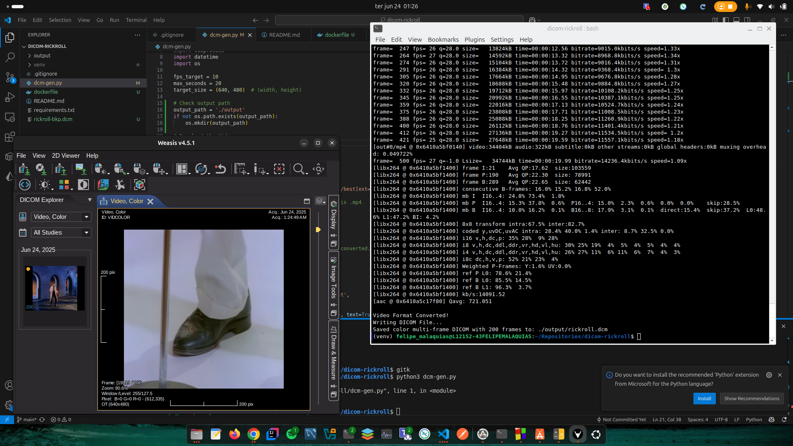

# Dicom Rickroll
A Rickroll DICOM File Generator



## What is it?
This project generates a Rickroll Meme DICOM File!
Unfortunatelly i cannot provide the Rickroll DICOM file here due to copyright, that's why i created this script, it basically downloads the Youtube video, 
encodes it to the H.264 format and them convert it to DICOM format.

My objective here is not to just add the MPEG content into the DICOM dataset, actually i wanted to make everyframe as an instance, just like an MR/CT image.
This also garantees that almost any DICOM viewer can visualize this Rickroll.

## How to generate the Rickroll DICOM File?
First of all, you need to have FFMPEG installed on your computer, you can do it running this:
```
sudo apt install ffmpeg
```

I recommend you to create a venv, you can do it by running:
```
python -m venv venv
source venv/bin/activate     # Linux/macOS
```

And then you need to install the packages:
```
pip install -r requirements.txt
```

Now you are ready to run the python code and generate it, you just need to run:
```
python dcm-gen.py
```

## Improvements
- Generate a Docker Compose to easily generate the DICOM file..

## License
- None :)
